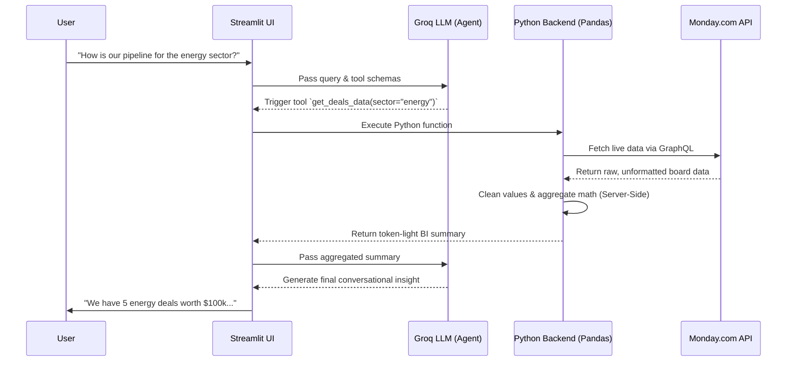

# Monday.com BI Intelligence Agent

## Overview
This is a conversational Business Intelligence (BI) agent built for company founders. It dynamically queries live monday.com boards to provide insights on pipeline health, revenue, and work order statuses. 

## Core Features
* **Live API Tool-Calling:** Utilizes Groq (Llama 3.3 70B) to autonomously trigger Python functions that hit the monday.com GraphQL API in real-time. No data is preloaded or cached.
* **Data Resilience:** A Pandas-powered cleaning pipeline sanitizes messy currency strings, handles null values, and performs server-side mathematical aggregation to protect LLM context windows.
* **Visible Agent Trace:** Streamlit renders a visible dropdown trace when the AI orchestrates an API call.
* **Cross-Board Intelligence:** The agent can route queries to the Deals board, the Work Orders board, or both simultaneously to answer complex business questions.

## Setup & Local Execution
1. Clone the repository and navigate to the root directory.
2. Install the required dependencies:
   `pip install -r requirements.txt`
3. Create a `.env` file in the root directory with the following keys:
   * `GROQ_API_KEY`
   * `MONDAY_API_TOKEN`
   * `DEALS_BOARD_ID`
   * `WORK_ORDERS_BOARD_ID`
4. Run the application:
   `streamlit run app.py`

## Testing
The application has been tested with the questions mentioned in the file test.txt

## Tech-Stack
1. The Frontend has been developed in Streamlit for quick prototyping and deployment
2. The Backend has been developed in Python for integrating LLM (Groq api) for live tool calling, data      preprocessing and cleaning (pandas & numpy), visible agent trace in the ui and cross board intelligence

## Architecture Note
This system utilizes Server-Side Aggregation. Rather than passing raw, heavy CSV data to the LLM (which risks token-limit crashes), Pandas performs the mathematical heavy lifting and returns a dense, token-light BI summary to the agent.

### 🔄 System Architecture Flow

